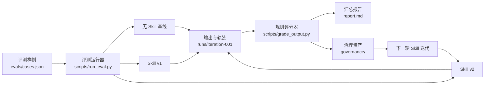

# Skill Engineering Lab


一个面向 AI Agent Skill 的工程化评测实验室。

它不是在展示“怎么把 Prompt 写长”，而是在展示一个 Skill 如何被设计成可触发、可评测、可回归、可治理的团队能力资产。

## 项目定位

在真实 Agent 系统里，Skill 最大的问题往往不是“能不能偶尔跑通”，而是：

- 该触发时是否稳定触发。
- 不该触发时是否克制。
- 触发后是否相对无 Skill 基线带来净增益。
- 增益是否值得额外 Token、耗时和维护成本。
- 失败样例能否反推下一轮迭代动作。
- Skill 最终能否沉淀为团队长期维护的资产。

本项目用一个可复现的本地实验，把同一批任务跑过三种状态：

```text
without_skill -> with_skill_v1 -> with_skill_v2
```

并把输出、评分、轨迹、失败归因和治理记录全部落盘，形成一条从“编写”到“评测”再到“治理”的闭环。

## 结果概览

当前示例主题是 `ai-video-creator-style`：输入 AI 产品信息，生成适合 B 站技术区的视频标题、封面文案、Demo 方案、大纲和口播稿。

| 配置 | 通过率 | 触发召回率 | 过度触发率 | 平均 Token | 平均耗时 |
| --- | ---: | ---: | ---: | ---: | ---: |
| 无 Skill | 16.7% | 不适用 | 不适用 | 720 | 480 ms |
| 使用 Skill v1 | 75.0% | 80.0% | 50.0% | 1142 | 828 ms |
| 使用 Skill v2 | 100.0% | 100.0% | 0.0% | 935 | 625 ms |

关键观察：

- v1 相比无 Skill 基线质量提升 58.3%，但存在明显误触发。
- v2 通过收紧 `description`、硬化 `SKILL.md` 契约、增加确定性校验脚本，将过度触发率从 50.0% 降到 0.0%。
- v2 相比 v1 质量继续提升 25.0%，同时平均 Token 下降 18.2%。

完整报告见 [report.md](report.md)。

## 可视化 Dashboard

项目内置一个纯静态 Dashboard，用来展示 Skill 版本质量、触发表现、失败模式和治理状态：

- 入口文件：[dashboard/index.html](dashboard/index.html)
- 数据文件：[dashboard/data.js](dashboard/data.js)
- 数据来源：`runs/iteration-001/benchmark.json` 与 `governance/*.json`

打开方式：

```bash
make dashboard-data
open dashboard/index.html
```

Dashboard 展示内容：

- 核心指标卡：质量提升、触发召回、过度触发下降、Token 变化。
- 三态对照表：无 Skill、Skill v1、Skill v2 的质量和成本。
- 失败模式收敛图：展示 v1 的问题如何在 v2 中被消除。
- 样例级回归视图：逐条 case 展示三种配置下的得分。
- 治理资产概览：版本决策、回归样例、失败归因和后续风险。

## 研究站点与方法论文章

为了便于作品集展示，本项目还提供两个面向读者的展示入口：

线上地址：[skill-engineering-lab.vercel.app](https://skill-engineering-lab.vercel.app)

| 入口 | 文件 | 用途 |
| --- | --- | --- |
| 研究型项目站 | [site/index.html](site/index.html) | 以公开研究站的方式讲清楚项目命题、证据、架构、benchmark 和治理闭环 |
| 方法论单页文章 | [docs/ai-agent-skill-engineering.html](docs/ai-agent-skill-engineering.html) | 将《AI Agent Skill 工程化实践优化版》排版成 paper-style 的高级 HTML 文档 |

打开方式：

```bash
open site/index.html
open docs/ai-agent-skill-engineering.html
```

这两个页面与 Dashboard 互相链接，形成“研究站 -> 方法论 -> Dashboard -> 报告”的完整展示路径。

## Vercel 部署

当前生产环境：

- [https://skill-engineering-lab.vercel.app](https://skill-engineering-lab.vercel.app)

项目已经准备好静态站点部署入口：

- 根入口：[index.html](index.html)，自动跳转到研究型项目站。
- Vercel 配置：[vercel.json](vercel.json)，将 `/` 重写到 `site/index.html`。

推荐部署方式：

1. 在 Vercel 导入 GitHub 仓库 `lihe/skill-engineering-lab`。
2. Framework Preset 选择 `Other`。
3. Root Directory 使用仓库根目录。
4. Build Command 留空。
5. Output Directory 使用 `.`。

也可以用 Vercel CLI：

```bash
vercel
vercel --prod
```

## 核心能力

这个项目覆盖了一个成熟 Skill 工程体系的最小闭环：

| 能力 | 本项目中的实现 |
| --- | --- |
| Skill 版本管理 | `skills/ai-video-creator-style/v1` 与 `v2` 对照 |
| 样例库 | `evals/cases.json`，包含核心、边界、扩展、负向样例 |
| 对照实验 | 同一批样例同时跑 `without_skill`、`with_skill_v1`、`with_skill_v2` |
| 分层评分 | 触发、产出、风格、效率、泛化五类检查 |
| 确定性校验 | `validate_package.py` 检查标题数量、封面行长和结构完整性 |
| 轨迹记录 | 每次运行记录路由、触发结果、参考资料加载情况 |
| 失败归因 | `governance/reason_archive.json` 记录根因和下一步动作 |
| 回归治理 | `governance/regression_set.json` 固化必须保留的黄金样例 |

## 系统架构



方法论上，本项目把 Skill 拆成六类资产：

```text
Skill = 路由入口
      + 任务契约
      + 按需加载的参考资料
      + 确定性脚本
      + 评测资产
      + 治理资产
```

## 快速开始

环境要求：

- Python 3.10+
- 无第三方依赖

运行完整评测：

```bash
python3 scripts/run_eval.py --skill ai-video-creator-style --cases evals/cases.json
```

重新生成报告：

```bash
python3 scripts/summarize_report.py runs/iteration-001
```

校验 v2 输出结构：

```bash
python3 skills/ai-video-creator-style/scripts/validate_package.py \
  runs/iteration-001/core-skill-eval-lab/with_skill_v2/output.md
```

如果使用 `make`：

```bash
make eval
make dashboard-data
make verify
make check
make site-check
```

## 评测设计

样例库当前包含 12 条种子样例：

| 类型 | 数量 | 目的 |
| --- | ---: | --- |
| 核心场景 | 6 | 验证标准 AI 产品视频创作任务能稳定完成 |
| 边界场景 | 2 | 验证信息稀疏或输入复杂时仍能泛化 |
| 扩展场景 | 2 | 验证只要标题池、只要封面文案等局部任务也能触发 |
| 负向场景 | 2 | 验证新闻稿、项目计划等相邻任务不会误触发 |

评分器不只看“好不好看”，而是拆成五类可诊断指标：

| 维度 | 评测问题 | 主要证据 |
| --- | --- | --- |
| 触发 | 该触发时是否触发，不该触发时是否沉默 | `actual_triggered` 与 `should_trigger` |
| 产出 | 标题、封面、Demo、大纲、口播是否齐全 | 输出结构和数量检查 |
| 风格 | 是否有 B 站技术区的实测感、对比感和开场钩子 | 文案钩子、旧新对比、封面行长 |
| 效率 | Token 与耗时是否在可接受范围内 | `timing.json` 与基线对比 |
| 泛化 | 边界和扩展样例是否仍然稳定 | `case_type` 与风险标签 |

更完整的方法论见 [docs/evaluation-methodology.md](docs/evaluation-methodology.md)。

## 目录结构

```text
skill-engineering-lab/
├── skills/
│   └── ai-video-creator-style/
│       ├── v1/
│       ├── v2/
│       ├── references/
│       └── scripts/
├── evals/
│   ├── cases.json
│   └── files/
├── runs/
│   └── iteration-001/
├── scripts/
│   ├── grade_output.py
│   ├── run_eval.py
│   └── summarize_report.py
├── governance/
│   ├── versions.json
│   ├── reason_archive.json
│   └── regression_set.json
├── dashboard/
│   ├── index.html
│   ├── app.js
│   ├── style.css
│   └── data.js
├── site/
│   ├── index.html
│   ├── app.js
│   └── styles.css
├── docs/
│   ├── ai-agent-skill-engineering.html
│   ├── architecture.md
│   ├── evaluation-methodology.md
│   ├── research-site-brief.md
│   └── portfolio-one-pager.md
├── Makefile
├── report.md
└── README.md
```

## 工程亮点

- 把 Skill 从“提示词文件”升级为带版本、评测、回归和治理的工程资产。
- 用确定性评测保障分享演示稳定，不依赖网络、模型波动或 API 费用。
- 用对照实验量化 Skill 的净增益，而不是只展示单次成功输出。
- 用静态 Dashboard 将触发质量、失败模式和治理资产可视化，便于作品集展示和现场讲解。
- 用研究型项目站和 paper-style 方法论文章增强公开展示质感，适合简历、作品集和面试讲解。
- 将失败样例沉淀为可行动的根因归档，直接驱动下一轮 `description`、`SKILL.md` 和脚本迭代。
- 将可脚本化的结构检查下沉到 Python 校验器，降低自然语言评测的不确定性。

## 适合展示的讲法

一句话版本：

> 我做了一个 Agent Skill 工程化评测实验室，用同一批样例对比无 Skill、Skill v1、Skill v2，自动生成触发、质量、效率和治理报告，展示 Skill 如何从提示词沉淀为可回归的团队能力资产。

带 Dashboard 版本：

> 我做了一个 Agent Skill 工程化评测实验室和可视化 Dashboard，用同一批样例对比无 Skill、Skill v1、Skill v2，展示触发召回、过度触发、质量提升、Token 成本和失败归因，形成从 Skill 编写、评测到治理的完整闭环。

项目讲解材料：

- [site/index.html](site/index.html)：研究型项目站。
- [docs/ai-agent-skill-engineering.html](docs/ai-agent-skill-engineering.html)：方法论 HTML。
- [docs/portfolio-one-pager.md](docs/portfolio-one-pager.md)：项目OnePage。
- [docs/architecture.md](docs/architecture.md)：系统架构与数据流。
- [docs/evaluation-methodology.md](docs/evaluation-methodology.md)：评测方法论。


## 后续路线

- 接入真实大模型调用，保留当前评分与治理接口。
- 增加真实历史产品 brief 作为回归样例。
- 将当前研究站点发布到 Vercel 或 GitHub Pages。
- 引入 LLM Judge 作为风格评价补充，但保留确定性检查作为主验收。
- 支持多 Skill 横向对比，识别职责重叠、触发冲突和可退休 Skill。
