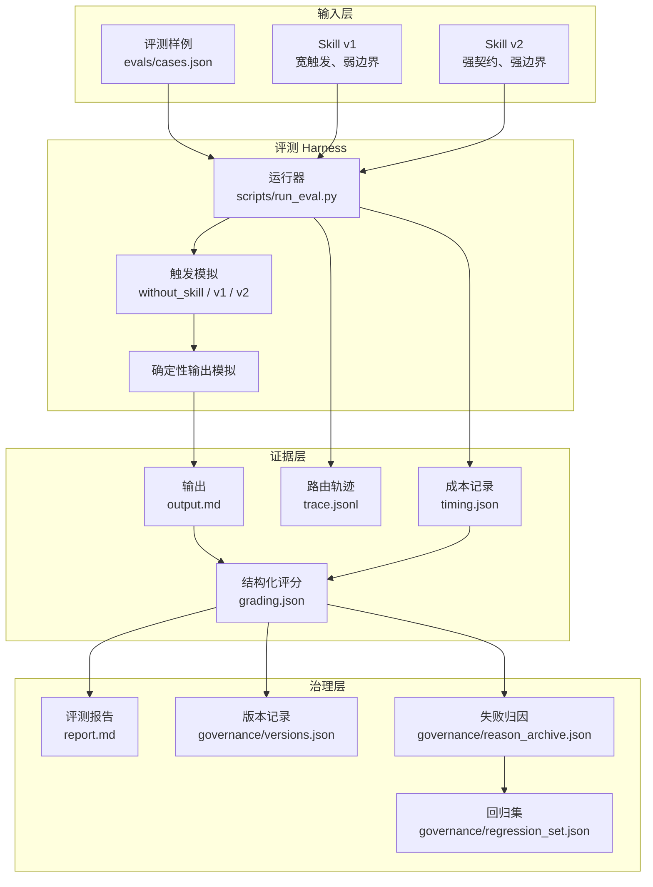

# 系统架构

Skill Engineering Lab 是一个本地可复现的 Skill 评测与治理 Harness。它的重点不是生成内容本身，而是把 Skill 行为变成可观察、可评分、可比较、可治理的工程对象。

## 架构总览



## 运行链路

1. 从 `evals/cases.json` 读取样例。
2. 对每条样例分别运行三种配置：`without_skill`、`with_skill_v1`、`with_skill_v2`。
3. 为每次运行生成输出、路由轨迹、成本估算和评分结果。
4. 汇总所有结果，生成 `runs/iteration-001/benchmark.json`。
5. 将 benchmark 转成 `report.md`。
6. 将关键失败样例沉淀到治理资产中。

## 为什么要用确定性模拟

当前版本刻意不直接调用大模型接口，原因有三点：

- 分享演示更稳定，不受网络、模型版本、费用和温度随机性影响。
- 更容易展示 Skill v1 到 v2 的因果变化。
- 可以先打磨评测接口和治理资产，后续再替换真实模型调用。

生产化时，`scripts/run_eval.py` 中的确定性输出模拟可以替换为真实 Agent 调用，而评分器、报告器和治理资产可以继续沿用。

## 数据契约

每条样例至少包含：

```json
{
  "id": "core-skill-eval-lab",
  "case_type": "core",
  "risk_tag": ["full_package", "demo_hook"],
  "should_trigger": true,
  "prompt": "用户输入",
  "brief": {
    "product": "产品名",
    "category": "产品类别",
    "visible_result": "可见结果",
    "viewer": "目标观众"
  }
}
```

每次运行输出：

| 文件 | 作用 |
| --- | --- |
| `output.md` | 模拟 Agent 输出 |
| `trace.jsonl` | Skill 路由与参考资料加载轨迹 |
| `timing.json` | Token 和耗时估算 |
| `grading.json` | 分层评分、证据和失败模式 |

## 可扩展点

- 将确定性生成器替换为真实大模型调用。
- 增加 LLM Judge，用于补充风格、表达和业务语境评价。
- 增加 HTML dashboard，展示版本趋势、失败模式分布和样例详情。
- 支持多 Skill 横向对比，识别过度触发和职责重叠。
